# PulseControlERP - System Architecture Diagram

This diagram shows the high-level technical architecture for the multi-tenant ERP platform.

## High-Level Architecture

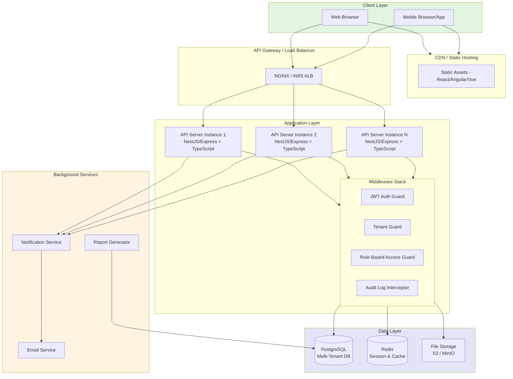

## Request Flow with Tenant Isolation

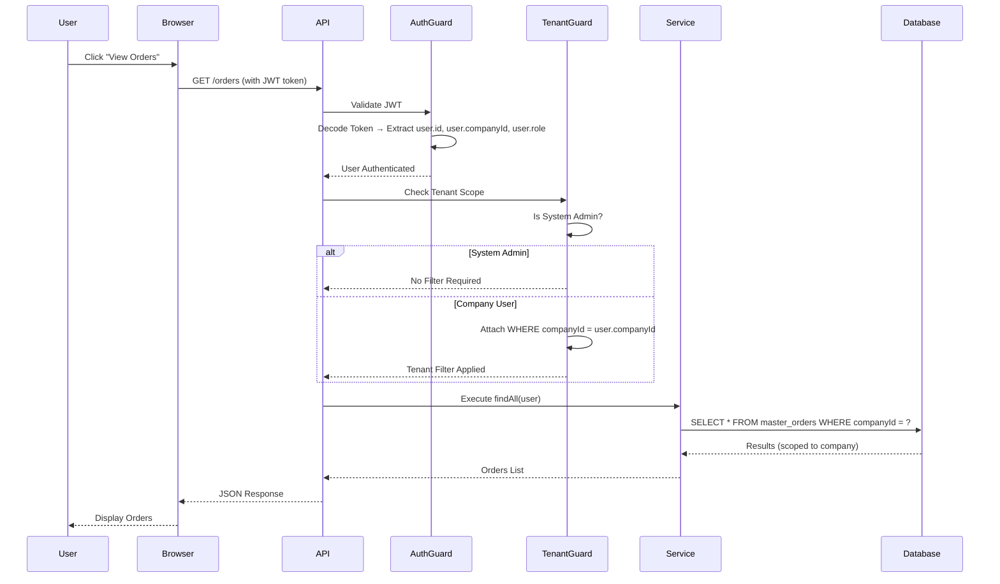

## Authentication & Authorization Flow

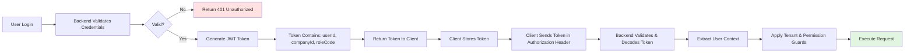

## Multi-Tenancy Data Isolation Strategy

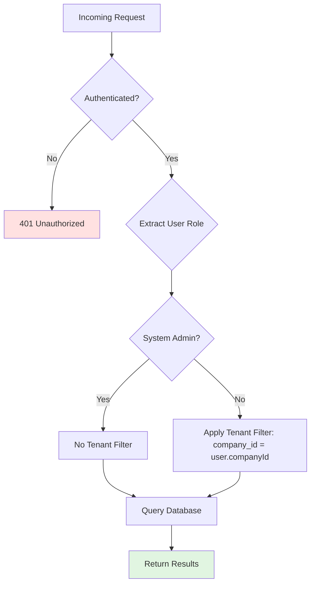

## Database Schema Pattern (Multi-Tenant)

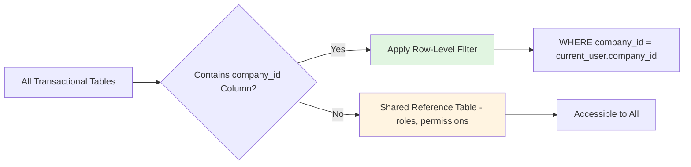

## Notification Architecture

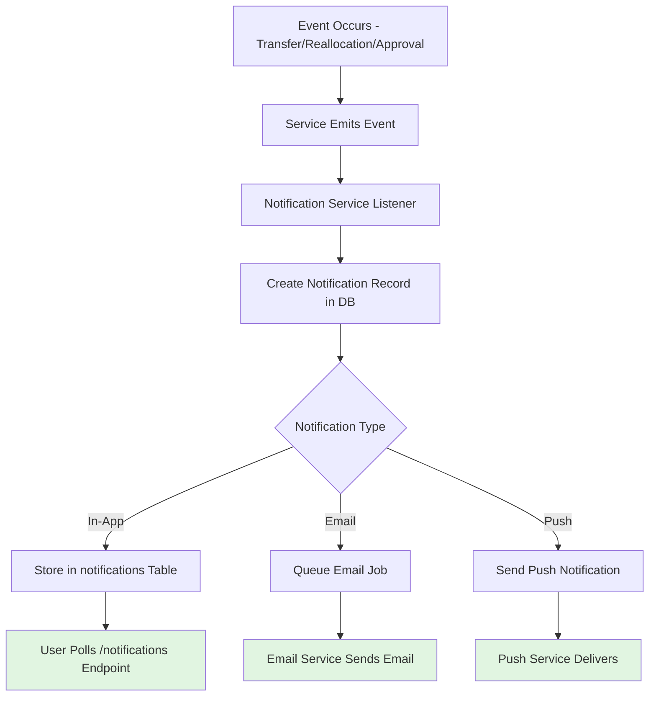

## Module Architecture (Backend)

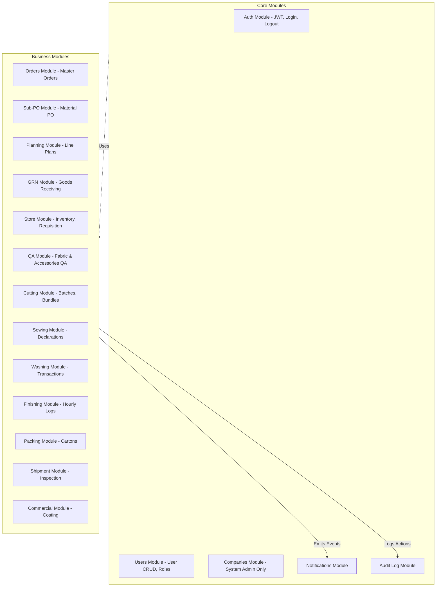

## Security Layers

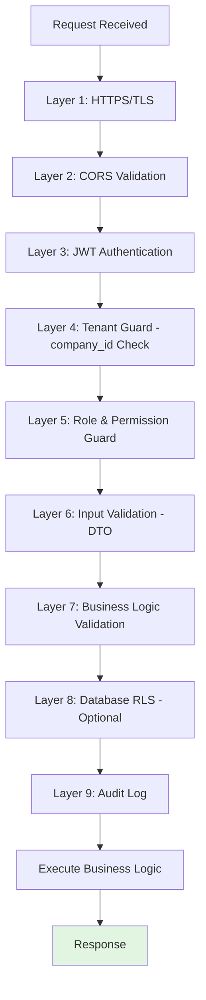

## Deployment Architecture (AWS Example)

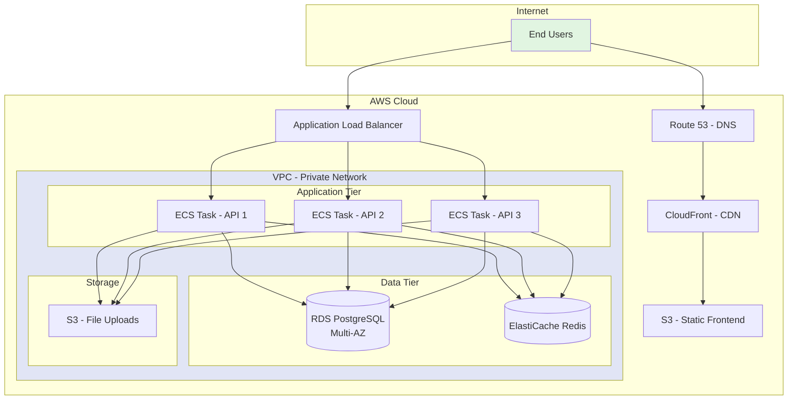

## Technology Stack Summary

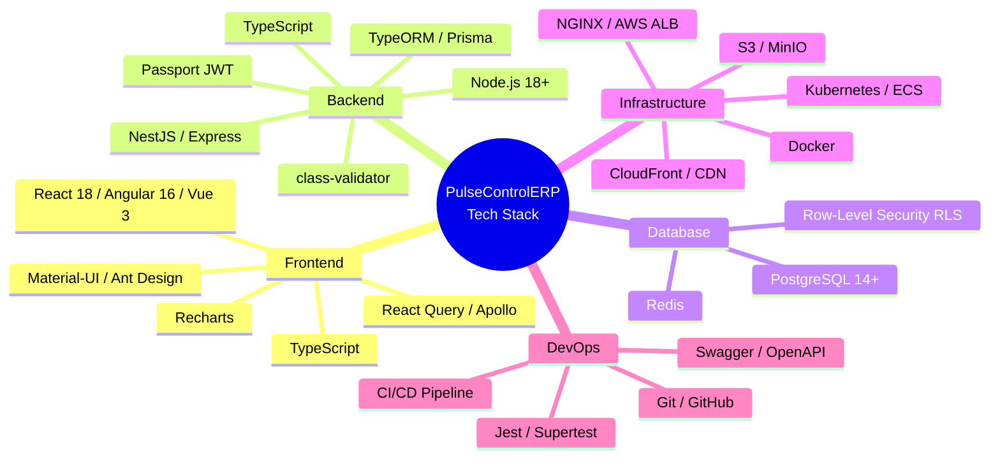

## Data Flow: Order to Shipment

```mermaid
flowchart LR
    A[Master Order Created] -->|Merchandising| B[Sub-PO Created]
    B -->|Approval| C[GRN Received]
    C -->|Store| D[Inventory Updated]
    D -->|QA| E[Material Inspected]
    E -->|Planning| F[Line Allocated]
    F -->|Cutting| G[Bundles Generated]
    G -->|Sewing| H[Output Declared]
    H -->|Washing/Finishing| I[Finishing Complete]
    I -->|Packing| J[Cartons Created]
    J -->|Shipment| K[Inspection & Packing List]
    K -->|Commercial| L[Cost Analysis & Profit]
    
    style A fill:#e1f5e1
    style L fill:#ffe1e1
```

## Scalability Considerations

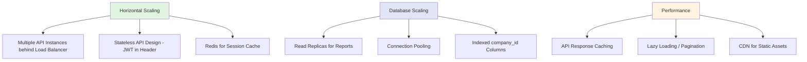
