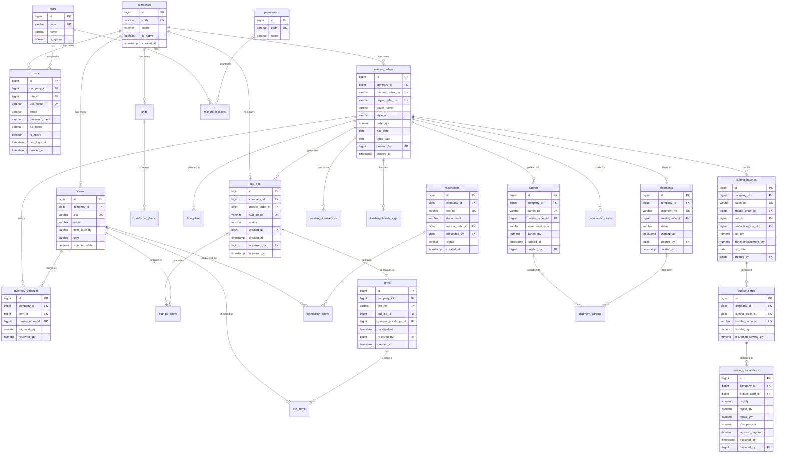
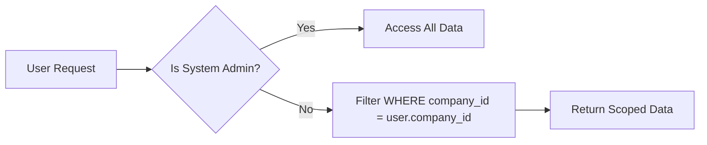

# PulseControlERP - Entity Relationship Diagram (ERD)

This diagram shows the core database relationships for the multi-tenant ERP system.

## Core ERD (Mermaid Format)

## Tenant Isolation Pattern

Every transactional table includes `company_id` to enforce tenant boundaries:

## Key Relationships Summary

1. **Multi-Tenancy**: All tables reference `companies.id` via `company_id`
2. **Order Flow**: `master_orders` → `sub_pos` → `grns` → `inventory_balances`
3. **Production**: `line_plans` → `cutting_batches` → `bundle_cards` → `sewing_declarations`
4. **Fulfillment**: `finishing_hourly_logs` → `cartons` → `shipments`
5. **Traceability**: All records link back to `master_orders` via `master_order_id`
