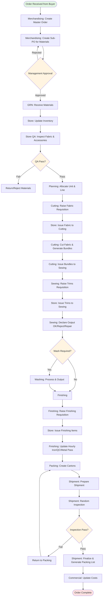
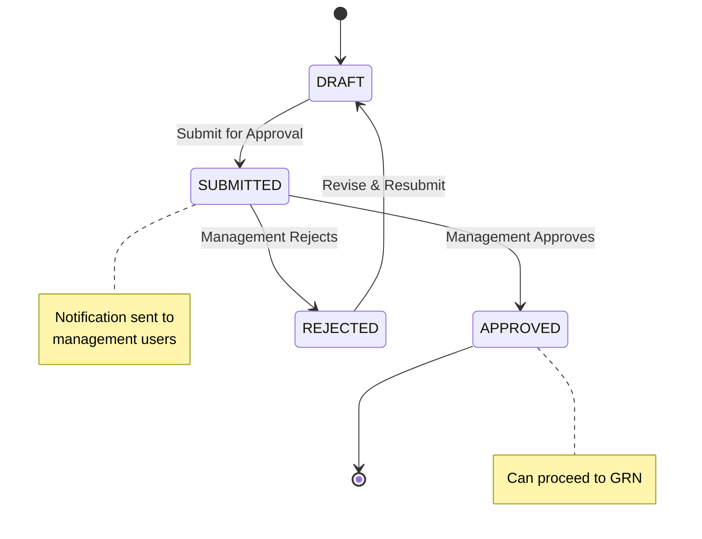
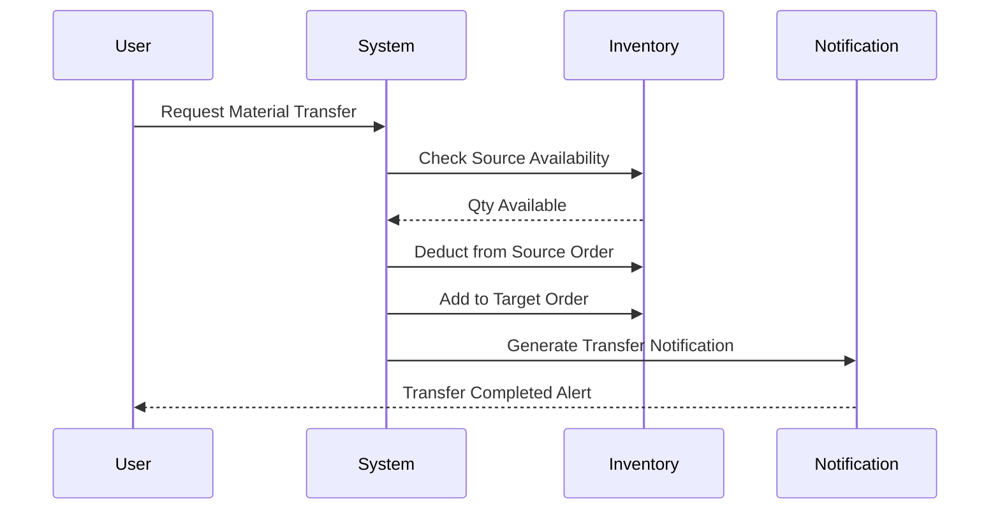
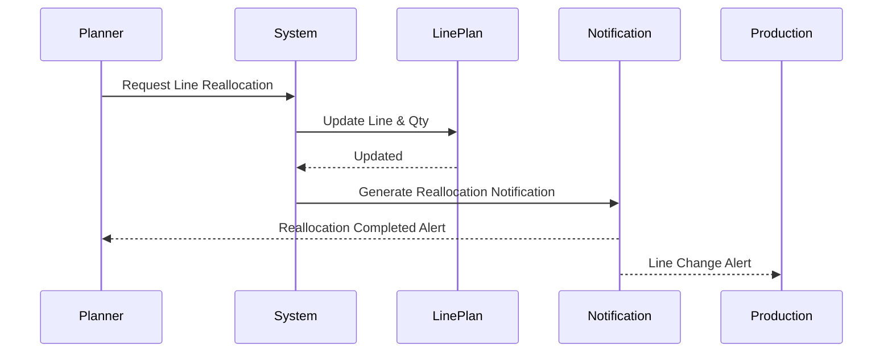
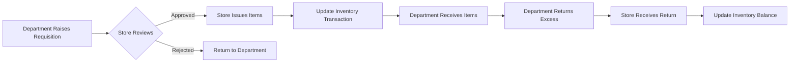
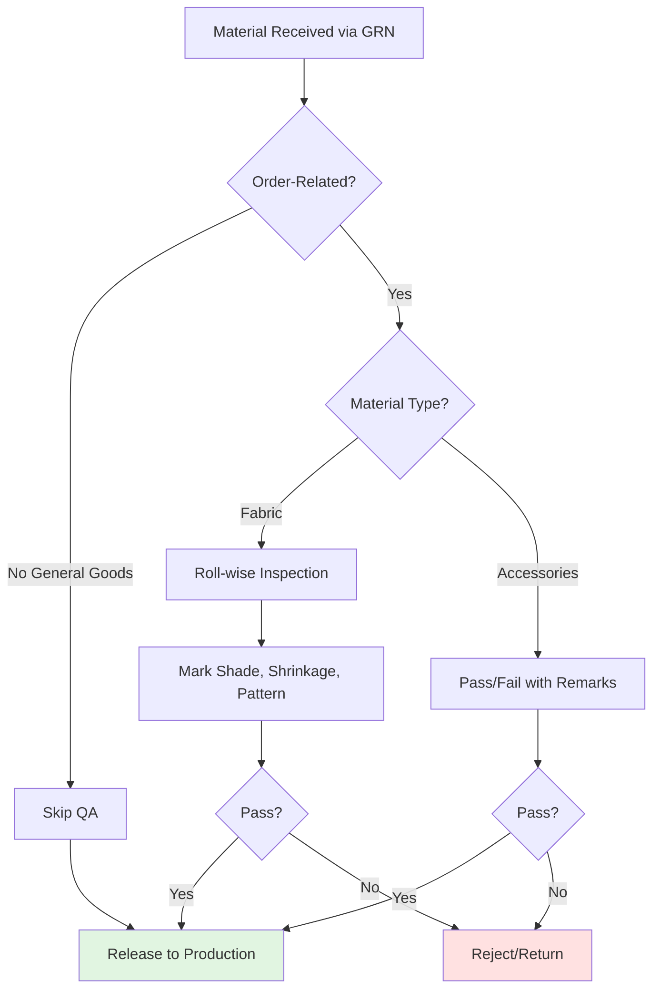
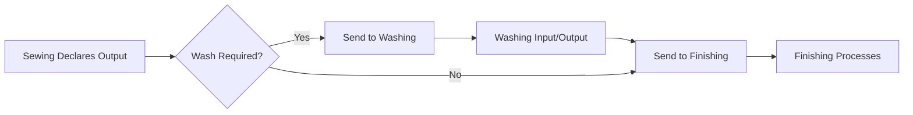
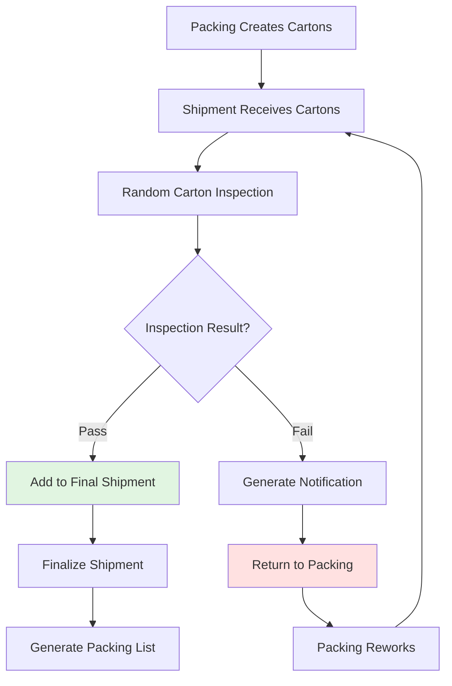
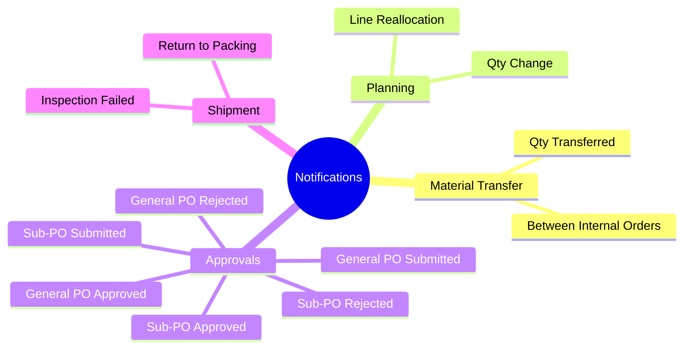

# PulseControlERP - Department Workflow Diagram

This diagram illustrates the end-to-end order fulfillment workflow across departments.

## End-to-End Order Flow

## Approval Workflow (Sub-PO & General Goods PO)

## Material Transfer Notification Flow

## Planning Reallocation Notification Flow

## Requisition to Issue Flow

## QA Decision Flow

## Sewing to Finishing Routing

## Shipment Inspection & Rework Flow

## Notification Trigger Events

## Multi-Department Handoff Summary

| From Department | To Department | Trigger Event | Data Passed |
|-----------------|---------------|---------------|-------------|
| Merchandising | Planning | Order Created | Master Order + PCD/BPCD |
| Planning | Cutting | Line Allocated | Unit, Line, Planned Qty |
| Cutting | Sewing | Bundles Issued | Bundle Cards with Barcode |
| Sewing | Washing | Wash Item Declared | Sewing Output Qty |
| Washing | Finishing | Washing Complete | Output Qty |
| Sewing | Finishing | Non-wash Item | Sewing Output Qty |
| Finishing | Packing | Metal Pass | Metal Pass Qty |
| Packing | Shipment | Cartons Ready | Carton List |
| Shipment | Commercial | Shipment Finalized | Delivery Details |

## Critical Decision Points (Approval Gates)

1. **Sub-PO Approval**: Management must approve before GRN
2. **General Goods PO Approval**: Management must approve before GRN
3. **QA Pass**: Materials must pass QA before production use
4. **Shipment Inspection**: Random cartons must pass before final shipment
